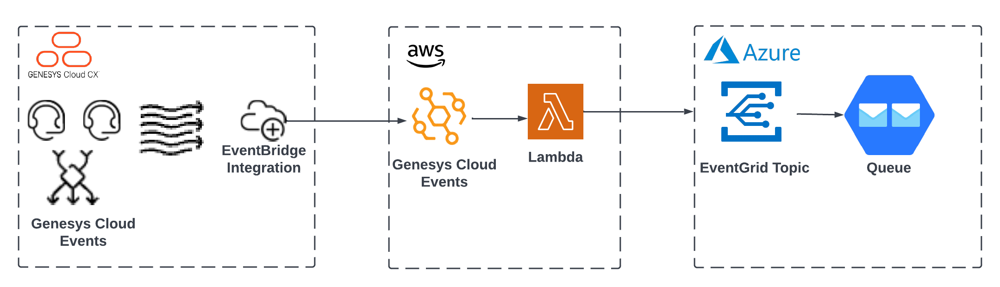

# Send Genesys Cloud events from AWS EventBridge to Azure EventGrid

View the [Send Genesys Cloud events from AWS EventBridge to Azure EventGrid](https://github.com/GenesysCloudBlueprints/genesyscloud-eventbridge-eventgrid-blueprint "Send Genesys Cloud events from AWS EventBridge to Azure EventGrid"). 

This blueprint demonstrates how to use Genesys Cloud's AWS EventBridge integration and an AWS Lambda to pass messages from Genesys Cloud over to Azure EventGrid. You can deploy the AWS Lambda, all the AWS IAM roles, and all the CX as Code components from within a single Terraform/CX as Code project.

You can view the complete blueprint and download the sample files from [here](https://github.com/GenesysCloudBlueprints/genesyscloud-eventbridge-eventgrid-blueprint "Send Genesys Cloud events from AWS EventBridge to Azure EventGrid").

